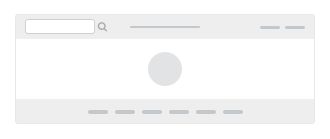
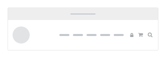
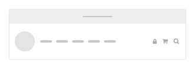
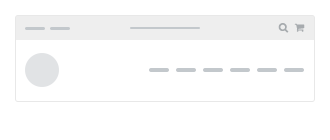
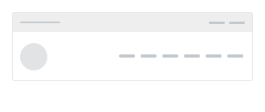

# Headers

---

Render the header, main menu and slide in menu of website which show in every pages.

---

## Liquid

* `header1.liquid`
* `header2.liquid`
* `header3.liquid`
* `header4.liquid`
* `header5.liquid`
* `header6.liquid`
* `header7.liquid`
* `header8.liquid`
* `header9.liquid`
* `header10.liquid`
* `header11.liquid`
* `header12.liquid`
* `header13.liquid`
* `main-navigation.liquid`
* `slidein-header.liquid`

## Layout

### header1.liquid

### header2.liquid

### header3.liquid

### header4.liquid

### header5.liquid

### header6.liquid

### header7.liquid

### header8.liquid

### header9.liquid

### header10.liquid

### header11.liquid

### header12.liquid

### header13.liquid

### main-navigation.liquid

.png>)

### slidein-header.liquid

