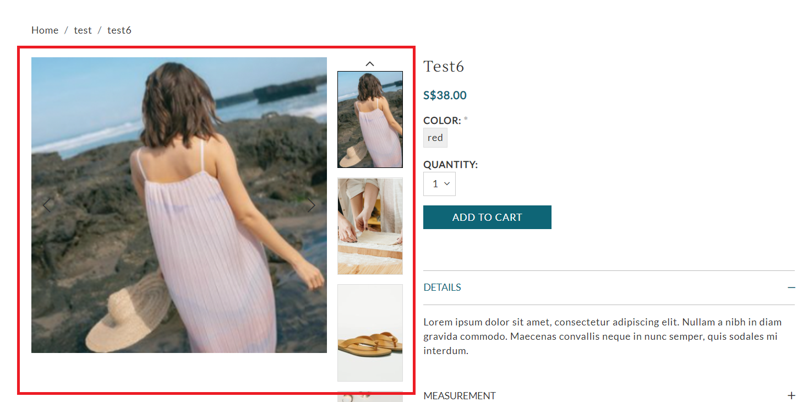
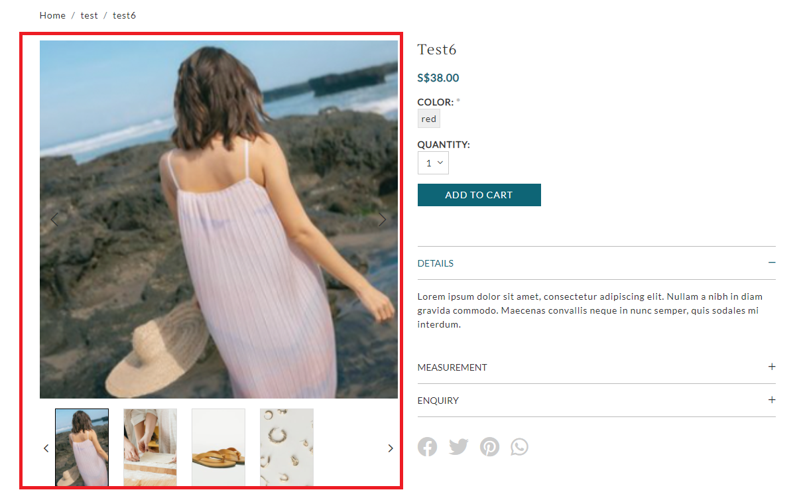
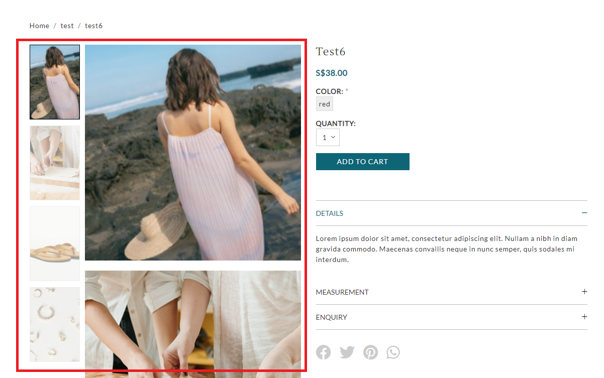
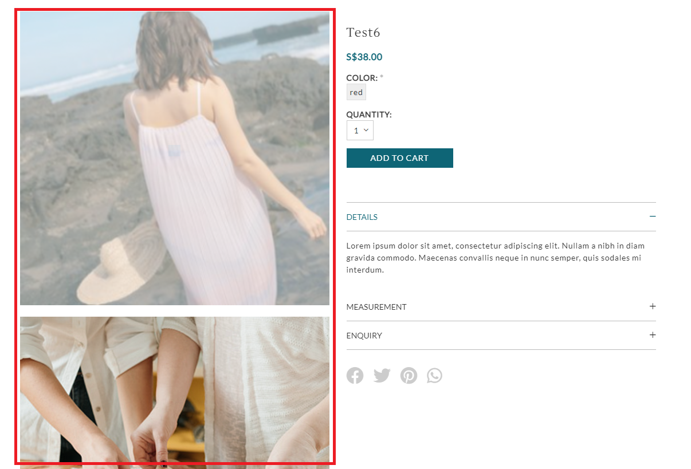

# Product Images

---

Render multiple product images and thumbnail in product detail page.

---

## Liquid

* `image1.liquid`
* `image2.liquid`
* `image3.liquid`
* `image4.liquid`
* `image5.liquid`
* `all-images.liquid`
* `photoswipe.liquid`
* `thumbnails.liquid`

## Layout

### image1.liquid

.png>)

### image2.liquid

### image3.liquid

### image4.liquid

### image5.liquid

### photoswipe.liquid

.png>)

