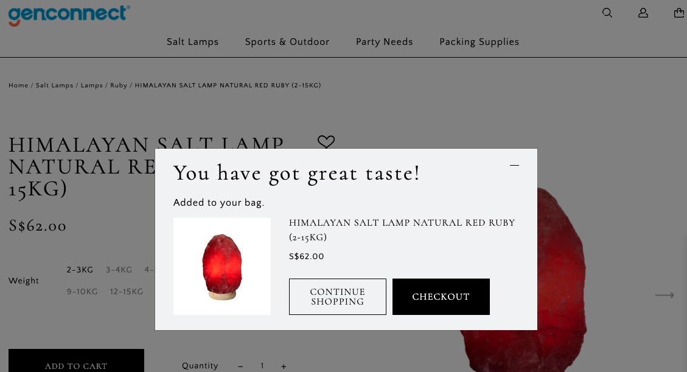

# added\_cart\_message.liquid

---

added_cart_message.liquid renders the content of popup cart, only add this file based on client's requirement.

---

Enable Ajax Cart Message in admin/shopcada/superadmin,&#x20;

Enable advance add to cart complete message in admin/shopcada/ajax\_cart

Note: this is different from `ajax-cart-template.liquid`

## Layout




## Available Liquid Variables

#### 1. Cart

[cart](liquid/variables/cart.md)

```
{{ cart }}
```


#### 2. Cart Product

[cart_product](liquid/variables/cart/cart-product.md)

```
{{ cart_product }}
```


#### 3. Product

[products](liquid/variables/products.md)

```
{{ product }}
```

## Available JS function to modify

```
Shopcada.theme.prototype.ajaxCartMessage { ... }
function ajaxCartFormSubmitted(e) { ... }
function ajaxCartBlockUIRemove(url) { ... }
```

