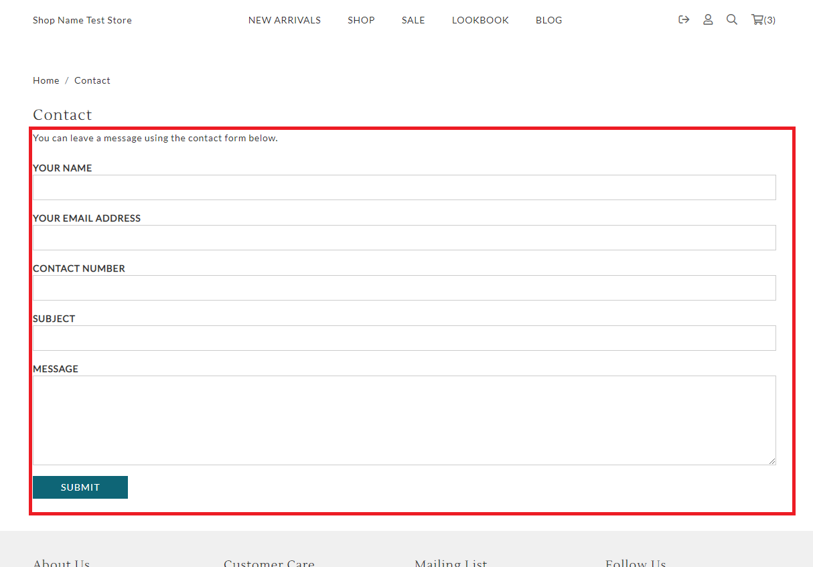

# contact.liquid

---

contact.liquid provides a enquiry form for customers to leave some messages to merchants.

---

## Layout

.png>)

## Available Liquid Variables

#### 1. Contact

[pages](liquid/variables/pages.md)

```
{{ contact_info_panel }}
{{ contact_thank_you_message }}
{{ contact_form_header }}
```


#### 2. Contact Form

```
 
```



