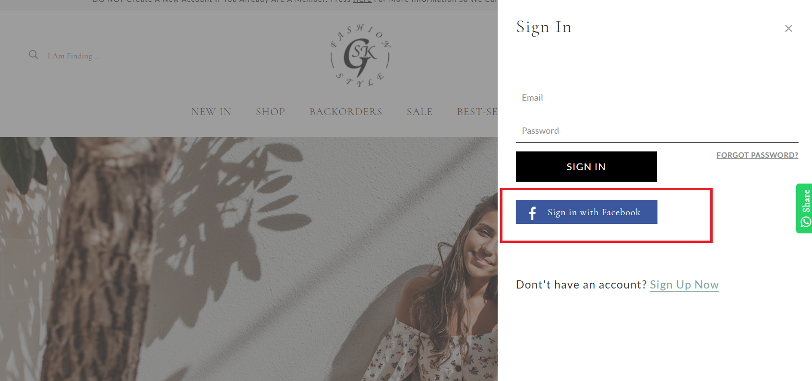

# account\_panel.liquid

---

account_panel.liquid is used for having account drawer as quick way to show
the list of account links or authorization form.

---

## Layout

.png>)

.png>)

## Available Liquid Variables

#### 1. Customer

[account](liquid/variables/account.md)

```
{{ customer }}
```

#### 2. Social Login

```
{{ social_login }}
```



#### 3. Login Form

```
 
```


#### 4. Register Form

```
 
```


