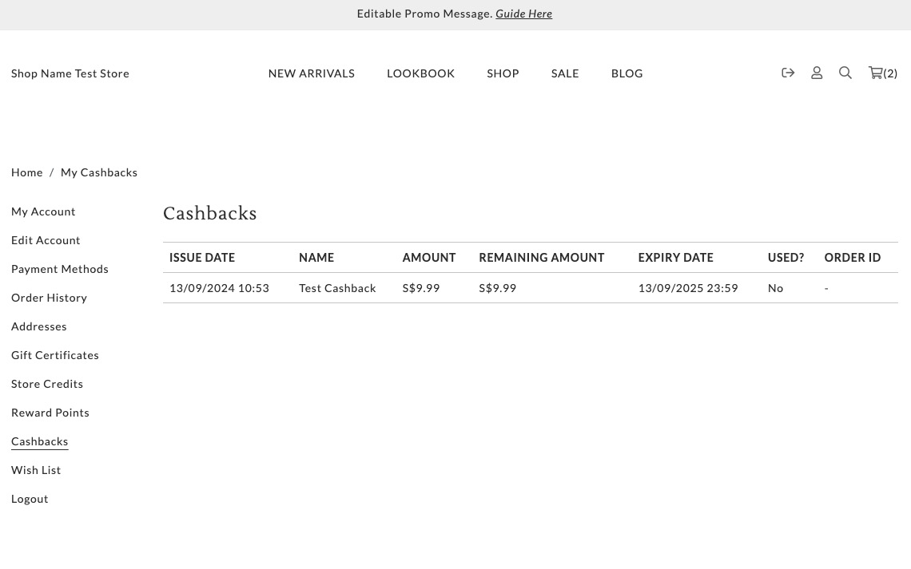

# cashbacks.liquid

---

cashbacks.liquid renders a list of cashbacks information in table form.

---

## Layout

<figure><figcaption><p>Cash Backs</p></figcaption></figure>

## Available Liquid Variables

#### 1. Customer

[account](liquid/variables/account.md)

```
{{ customer }}
```

#### 2. Cashbacks

[cashback](liquid/variables/cashback.md)

```
{{ customer.cashback.cashbacks }}
```
