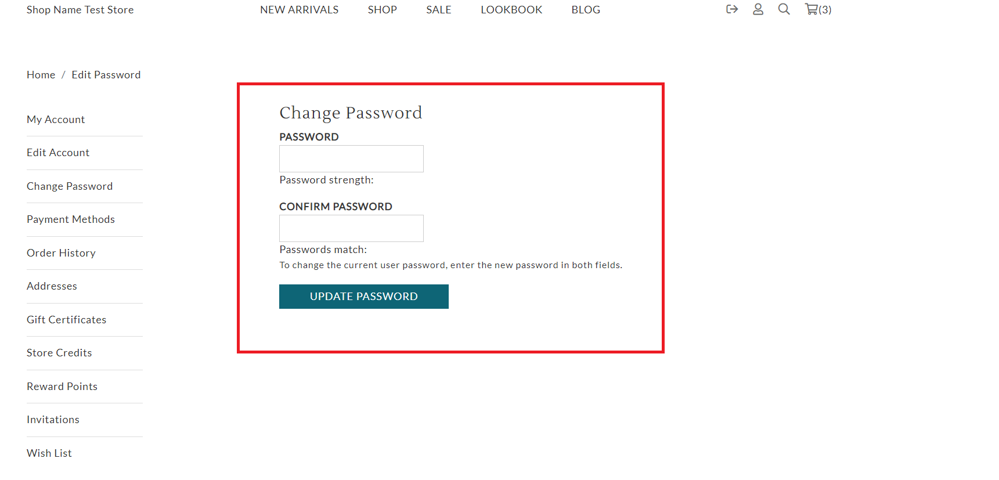

# change\_password.liquid

---

change_password.liquid renders a form for customers to change their password.

---


## Layout

.png>)

## Available Liquid Variables

#### 1. Customer

[account](liquid/variables/account.md)

```
{{ customer }}
```

#### 2. Change Password Form

```
 
```



