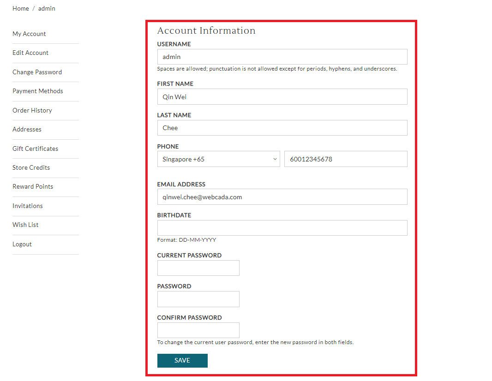

# edit\_account.liquid

---

edit_account.liquid provides form for customers to change account information
such as username, email and contact number.

---

## Layout

.png>)

## Available Liquid Variables

#### 1. Customer

[account](liquid/variables/account.md)

```
{{ customer }}
```

#### 2. Edit Account Form

```
 
```



