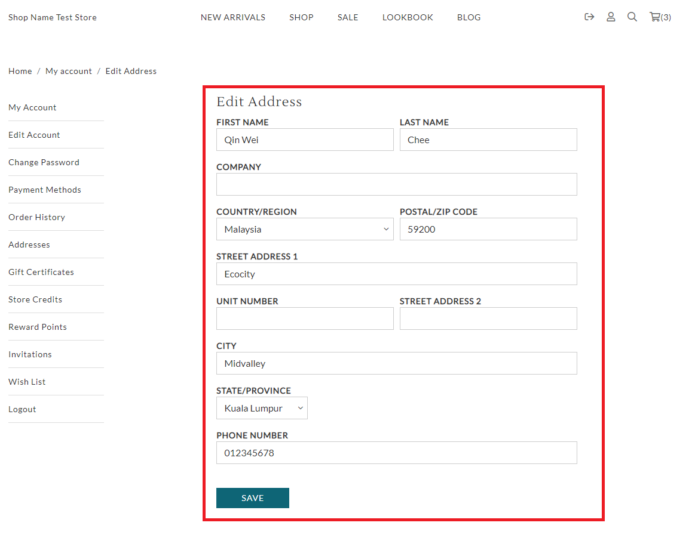

# edit\_address.liquid

---

edit_address.liquid renders edit address form for customers to change their
address details.

---

## Layout

.png>)

## Available Liquid Variables

#### 1. Customer

[account](liquid/variables/account.md)

```
{{ customer }}
```

#### 2. Edit Address Form

```
 
```



