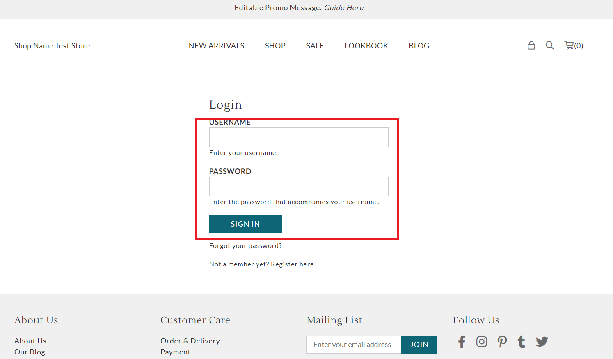

# login.liquid

---

login.liquid provides login form for customers who have an account to log in.

---

## Layout

.png>)

## Available Liquid Variables

#### 1. Customer

[account](liquid/variables/account.md)

```
{{ customer }}
```


#### 2. Social Media Login

```
{{ social_login }}
```

#### 3. Login Form

```
 
```



