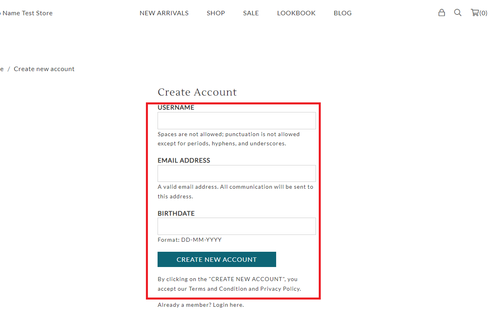

# register.liquid

---

register.liquid renders registration form for customers who did not have any account in the store.

---

## Layout

.png>)

## Available Liquid Variables

#### 1. Customer

[account](liquid/variables/account.md)

```
{{ customer }}
```

#### 2. Register Form

```
 
```


