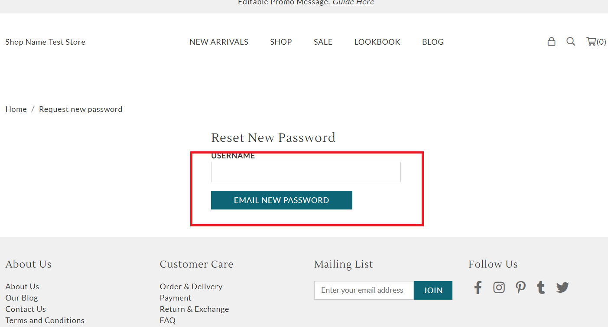

# reset\_password.liquid

---

reset_password.liquid shows the reset password form for customers who forgot their password.

---

## Layout

.png>)

## Available Liquid Variables

#### 1. Customer

[account](liquid/variables/account.md)

```
{{ customer }}
```

#### 2. Reset Password Form

```
 
```


