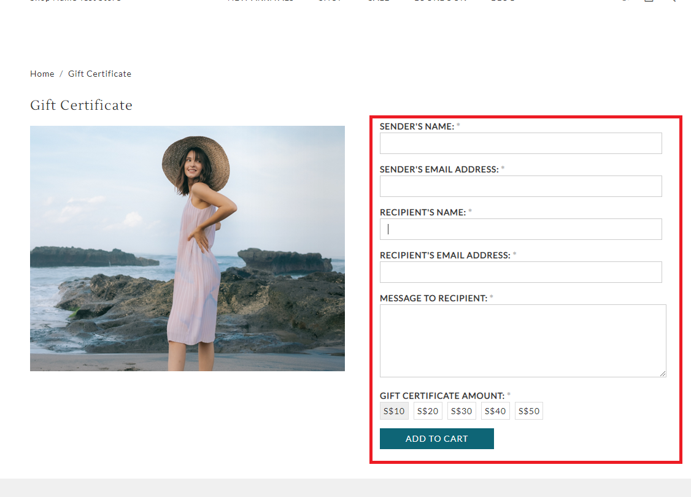

# gift\_certificate.liquid

---

gift_certifcate.liquid renders gift certificate details and form to allow customers to purchase gift voucher for themselves or others.

---

## Layout

.png>)

## Available Liquid Variables

#### 1. Advanced Gift Certificate

```
{{ advance_gift_certificate }}
```

#### 2. Description

```
{{ description }}
```

#### 3. Gift Certificate Form

```
{{ 'gift_certificate' | shopcada_form }}

// Output

<form action="/gift-certificate" accept-charset="UTF-8" method="post" id="uc-gift-certificate-add-to-cart-form">
 <div class="form-item element-type-textfield" id="edit-sender-name-wrapper">
   <label for="edit-sender-name">Sender's Name: <span class="form-required" title="This field is required.">*</span></label>
   <input type="text" maxlength="128" name="sender_name" id="edit-sender-name" size="60" value="" class="form-text required clickprocessed">
 </div>
 <div class="form-item element-type-email" id="edit-sender-email-wrapper">
  <label for="edit-sender-email">Sender's Email Address: <span class="form-required" title="This field is required.">*</span></label>
  <input type="email" maxlength="128" name="sender_email" id="edit-sender-email" size="60" value="" class="form-text form-email required">
 </div>
 ...
 ...
 ...
 <input type="submit" name="op" id="edit-submit" value="Add to cart" class="notranslate form-submit">
</form>
```



