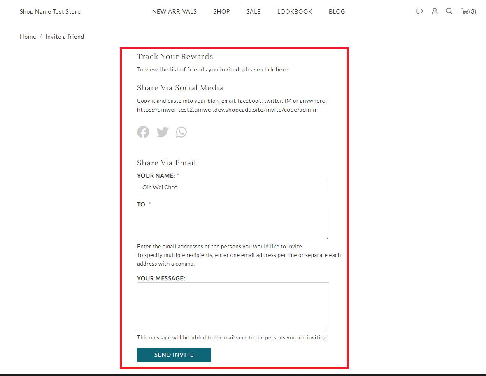

# invite.liquid

---

invite.liquid is also named as Refer a Friend, it provides a list of invite friend method including link, social media and email.

---

Layout

.png>)

## Available Liquid Variables

#### 1. Invite Message

```
{{ invite_message }}
```

#### 2. Allow Invite

```
{{ allow_invite }}
```

#### 3. Invite Link

```
{{ invite_link }}
```

#### 4. Invite Form

```
{{ 'invite' | shopcada_form }}

// Output

<form action="/invite" accept-charset="UTF-8" method="post" id="invite-form">
 <div class="form-item element-type-textfield" id="edit-from-name-wrapper">
  <label for="edit-from-name">Your Name: <span class="form-required" title="This field is required.">*</span></label>
  <input type="text" maxlength="128" name="from_name" id="edit-from-name" size="60" value="Qin Wei Chee" class="form-text required">
 </div>
 <div class="form-item element-type-textarea" id="edit-email-wrapper">
  <label for="edit-email">To: <span class="form-required" title="This field is required.">*</span></label>
  <textarea cols="60" rows="3" name="email" id="edit-email" class="form-textarea required"></textarea>
  <div class="description">Enter the email addresses of the persons you would like to invite.<br>To specify multiple recipients, enter one email address per line or separate each address with a comma.</div>
 </div>
 ...
 ...
 ...
 <input type="submit" name="op" id="edit-submit" value="Send invite" class="notranslate form-submit">
</form>
```



