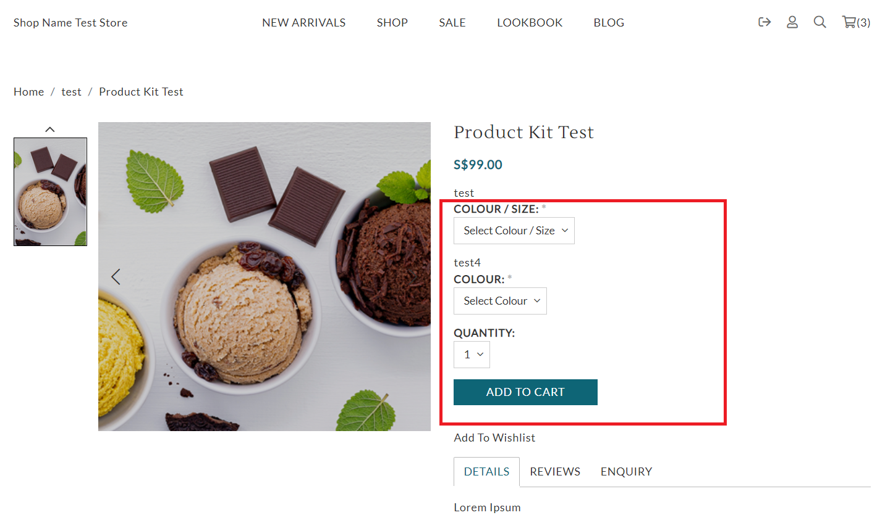

# product-kit.liquid

---

product-kit.liquid provides product kit information which allows customers to select multiple options from different products.

---

## Layout

.png>)

## Available Liquid Variables

#### 1. Product

[products](liquid/variables/products.md)

```
{{ product }}
```

#### 2. Add Kit To Cart Form

```
{{ 'add_kit_to_cart' | shopcada_form: product.id }}

<table><thead><tr><th>Output</th></tr></thead><tbody><tr><td><pre><code><form action="/callback/form" accept-charset="UTF-8" method="post" id="uc-product-kit-add-to-cart-form-24" class="productkit_add_to_cart_form ajax-cart-submit-form">
 <div class="attributes"><div class="subproduct-options">
  <div class="subproduct-name">test</div>
  <div class="form-item element-type-select" id="edit-attributes-11-wrapper">
   <label for="edit-attributes-11">Colour / Size: <span class="form-required" title="This field is required.">*</span></label>
   <span class="select"><select name="attributes[11]" class="form-select required chosen-widget" onchange="checkOutOfStock(11, this.value)" id="edit-attributes-11"><option value="" selected="selected">Select Colour / Size</option><option value="ABC 123456">Blue / M</option><option value="ABC 123456B">Red / S</option></select></span>
  </div>
 </div>
 ...
 ...
 ...
<input type="submit" name="op" id="edit-submit-24" value="Add to cart" class="notranslate form-submit node-add-to-cart primary ajax-cart-submit-form-button ajax-cart-processed">
</form>
```



