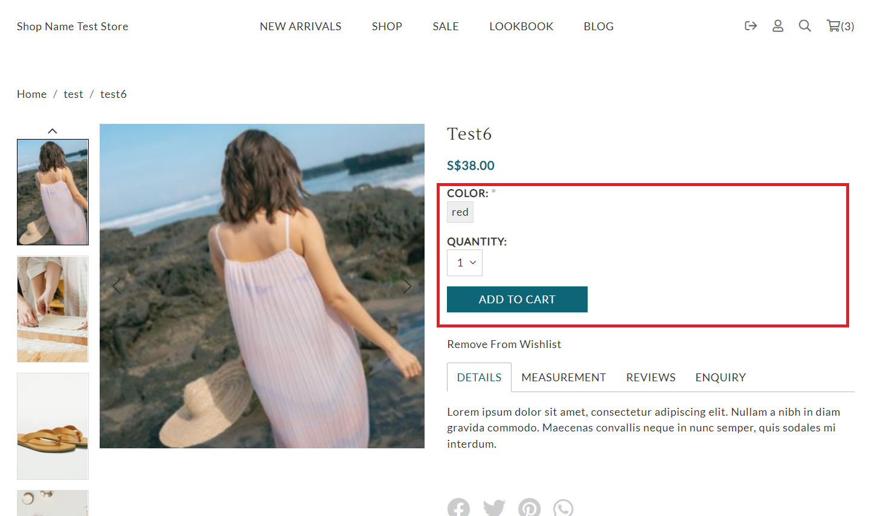

# product.liquid

---

product.liquid is also named as product details page which includes the product information, related product and images.

---

## Layout

.png>)

## Available Liquid Variables

#### 1. Product

[products](liquid/variables/products.md)

```
{{ product }}
```

#### 2. Add To Cart Form

```
{{ 'add_to_cart' | shopcada_form: product.id }}

// Output

<form action="/callback/form" accept-charset="UTF-8" method="post" id="uc-product-add-to-cart-form-16" class="ajax-cart-submit-form uc-aac-cart">
 <div class="attributes"><div class="form-item element-type-select no-select" id="edit-attributes-Color-wrapper">
  <label for="edit-attributes-Color">Color: <span class="form-required" title="This field is required.">*</span></label>
  <span class="select"><select name="attributes[Color]" class="form-select required aac-processed selectbutton2-processed" data-name="Color" id="edit-attributes-Color" style="display: none;"><option value="red">red</option></select><div class="selectbutton-container selectbutton-container-single clickprocessed" title=""><span class="selectbutton-option selectbutton-active" value="red">red</span></div></span>
 </div>
 ...
 ...
 ...
 <input type="submit" name="op" id="edit-submit-16" value="Add to cart" class="notranslate form-submit node-add-to-cart primary ajax-cart-submit-form-button ajax-cart-processed">
</form>
```



