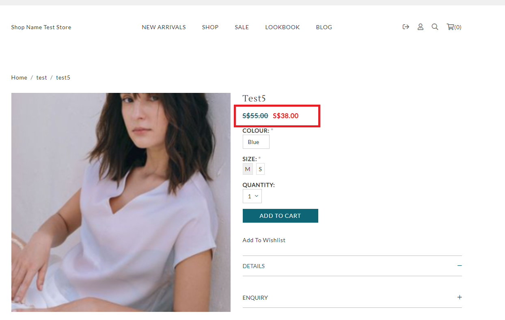

# product\_display\_price.liquid

---

product_display_price.liquid is the template which has backend process to show the product price dynamically. It includes product-price.liquid snippet.

---

## Layout

