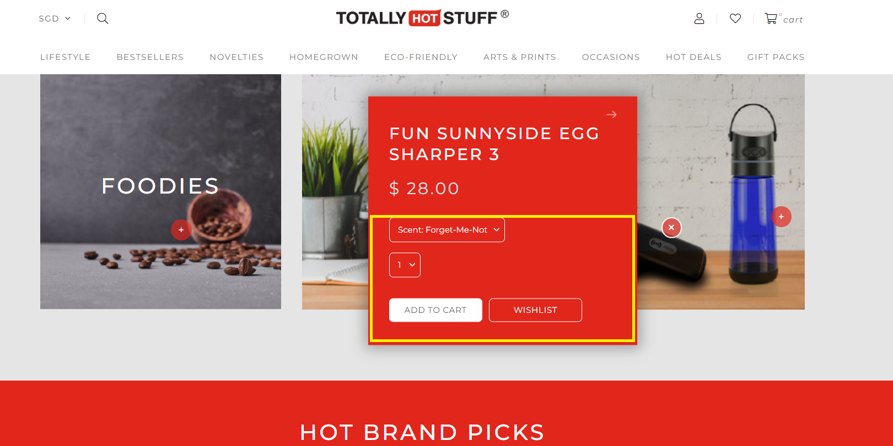

# product\_widget.liquid

---

Enable Product Drop Pin in Visual Editor Banner Widget in admin/shopcada/superadmin, create this file in template folder

---

## Layout

.png>)

## Available Liquid Variables

#### 1. Product

[products](liquid/variables/products.md)

```
{{ product }}
```

#### 2. Add To Cart Form

```
{{ 'add_to_cart' | shopcada_form: product.id }}

<table><thead><tr><th>Output</th></tr></thead><tbody><tr><td><pre><code><form action="/callback/form" accept-charset="UTF-8" method="post" id="uc-product-add-to-cart-form-22" class="ajax-cart-submit-form uc-aac-cart">
 <div class="attributes">
  <div class="form-item element-type-select" id="edit-attributes-Scent-wrapper">
   <label for="edit-attributes-Scent">Scent <span class="form-required" title="This field is required.">*</span></label>
   <span class="select"><select name="attributes[Scent]" class="form-select required chosen-widget" data-name="Scent" id="edit-attributes-Scent"><option value="Forget-Me-Not">Scent: Forget-Me-Not</option><option value="Test">Scent: Test</option><option value="Test2">Scent: Test2</option></select></span>
  </div>
 </div>
 ...
 ...
 ...
 <div class="product-action-wrapper">
  <input type="submit" name="op" id="edit-submit-22" value="Add to cart" class="notranslate form-submit node-add-to-cart primary ajax-cart-submit-form-button">
  <div data-nid="22" data-model="" id="wishlist_msg-22" class="wishlist_msg ajaxload wlprocessed"><a href="/account/login?destination=page%2F22" class="add_wishlist">Add To Wishlist</a></div>
 </div>
</form>
```



