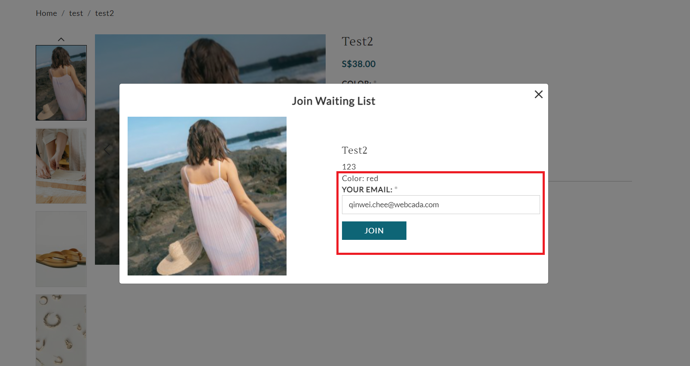

# waitlist.liquid

---

waitlist.liquid is a popup to allow customers to join waitling list when the product is out of stock, customer will be notified when the product is restocked.

---

## Layout

.png>)

## Available Liquid Variables

#### 1. Product

[products](liquid/variables/products.md)

```
{{ product }}
```

#### 2. Variant

```
{{ variant }}
```

#### 3. Waitlist Form

```


<form action="/callback/form" accept-charset="UTF-8" method="post" id="uc-waitlist-enterform" class="ajax-form">
 <div class="selectedattributes">Color: red</div>
 <div class="form-item element-type-textfield" id="edit-email-wrapper">
  <label for="edit-email">Your Email: <span class="form-required" title="This field is required.">*</span></label>
  <input type="text" maxlength="128" name="email" id="edit-email" size="60" value="qinwei.chee@webcada.com" class="form-text required">
 </div>
 <input type="submit" name="op" id="edit-submit" value="Join" class="notranslate form-submit ajax-trigger ajax-init-done">
 <div class="form-item element-type-textfield" id="edit-spamtracker113-wrapper">
  <input type="text" maxlength="128" name="spamtracker113" id="edit-spamtracker113" size="60" value="" style="position:absolute;left:-300000em;outline:none;margin:0;" autocomplete="off" class="form-text">
 </div>
</form>
```



