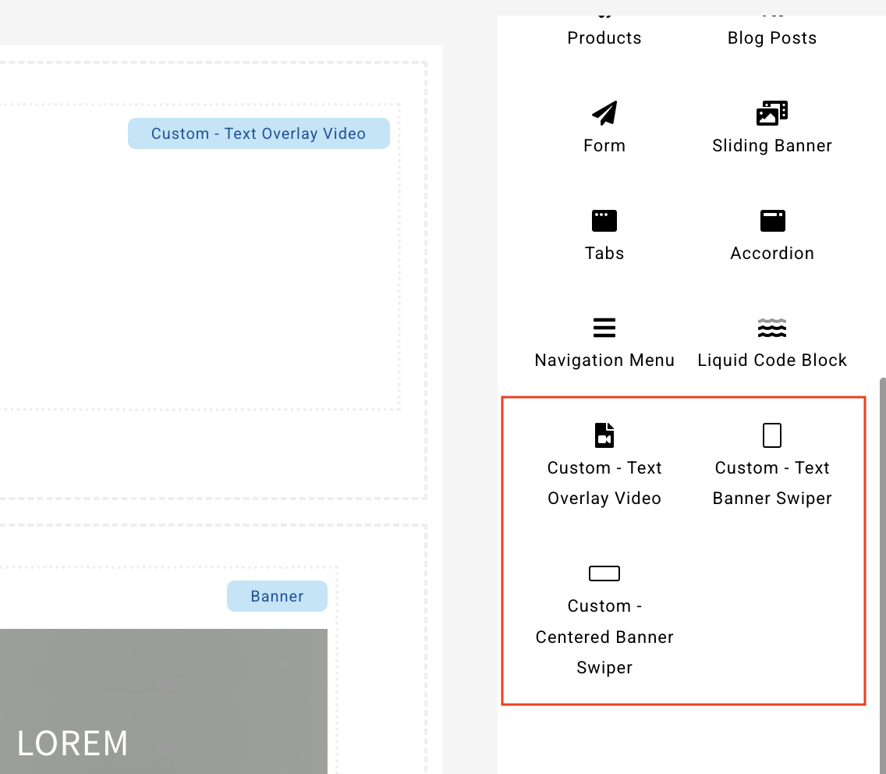

# Custom Visual Editor Widget

## Define A Custom Widget

To define a custom widget, the way as example below in `meta.json` file

```
"visual_editor_columns": [
    {
        "id": "meta_plugin_sample",
        "name": "Meta Plugin Sample",
        "icon": "<i class='fas fa-book'></i>",
        "column_type": "custom",
        "frontend_liquid_file": "visual_column_meta_plugin/sample/frontend.liquid",
        "editor_liquid_file": "visual_column_meta_plugin/sample/editor.liquid",
        "settings_schema": [
            {
                "label": "Textbox Content",
                "type": "textarea",
                "id": "sample_body",
                "description": "Contents to be place in textbox",
                "rich_text": true,
                "weight": 1
            },
            {
                "label": "Banner Image",
                "type": "image",
                "id": "sample_banner_upload",
                "count": 3,
                "column_config": {
                    "md": 4,
                    "sm": 4,
                    "xs": 12
                },
                "weight":2
            },
            {
                "label": "Banner Height",
                "type": "number",
                "id": "sample_banner_height",
                "field_suffix": "px",
                "prefix": "<div class='form-control-full-width'>",
                "suffix": "</div>",
                "column_config": {
                    "md": 12,
                    "sm": 12,
                    "xs": 12
                },
                "weight": 3
            },
            {
                "label": "Node",
                "type": "node",
                "node_types": [
                    "page",
                    "myproduct",
                    "productkit",
                    "blog",
                    "lookbook",
                    "webform"
                ],
                "node_multiple": false,
                "id": "sample_node",
                "column_config": {
                    "md": 12,
                    "sm": 12,
                    "xs": 12
                }
            },
            {
                "type": "fieldset",
                "id": "sample_horizontal_alignment",
                "label": "Horizontal Alignment",
                "description": null,
                "weight": 4,
                "count": 3,
                "expand": true,
                "collapsible": true,
                "collapsed": true,
                "column_config": {
                    "xs": 12
                },
                "child_column_config": {
                    "md": 4,
                    "sm": 4,
                    "xs": 12
                },
                "options": [
                    {
                        "label": "Desktop",
                        "type": "justify_content",
                        "id": "sample_ha_desktop",
                        "default":"center"
                    },
                    {
                        "label": "Tablet",
                        "type": "justify_content",
                        "id": "sample_ha_tablet",
                        "default":"center"
                    },
                    {
                        "label": "Mobile",
                        "type": "justify_content",
                        "id": "sample_ha_mobile",
                        "default":"center"
                    }
                ]
            },
            {
                "type": "fieldset",
                "id": "sample_vertical_alignment",
                "label": "Vertical Alignment",
                "description": null,
                "weight": 5,
                "collapsible": true,
                "collapsed": true,
                "column_config": {
                    "xs": 12
                },
                "child_column_config": {
                    "md": 3,
                    "sm": 3,
                    "xs": 12
                },
                "options": [
                    {
                        "label": "Desktop",
                        "id": "sample_va_desktop",
                        "type": "select",
                        "default":"center",
                        "options": [
                            {
                                "value": "start",
                                "label": "Top"
                            },
                            {
                                "value": "center",
                                "label": "Middle"
                            },
                            {
                                "value": "end",
                                "label": "Bottom"
                            }
            
                        ]
                    },
                    {
                        "label": "Tablet",
                        "type": "select",
                        "id": "sample_va_tablet",
                        "default":"center",
                        "options": [
                            {
                                "value": "start",
                                "label": "Top"
                            },
                            {
                                "value": "center",
                                "label": "Middle"
                            },
                            {
                                "value": "end",
                                "label": "bottom"
                            }
            
                        ]
                    },
                    {
                        "label": "Mobile",
                        "type": "select",
                        "id": "sample_va_mobile",
                        "default":"center",
                        "options": [
                            {
                                "value": "start",
                                "label": "Top"
                            },
                            {
                                "value": "center",
                                "label": "Middle"
                            },
                            {
                                "value": "end",
                                "label": "bottom"
                            }
                        ]
                    },
                    {
                        "label": "Video 1",
                        "type": "video", 
                        "id": "sample_video_upload",
                        "weight":2
                    }
                ]
            },
            {
                "type": "fieldset",
                "id": "sample_textbox_size",
                "label": "Textbox Size",
                "description": null,
                "weight": 6,
                "collapsible": true,
                "collapsed": true,
                "column_config": {
                    "xs": 12
                },
                "child_column_config": {
                    "md": 4,
                    "sm": 4,
                    "xs": 12
                },
                "options": [
                    {
                        "label": "Desktop",
                        "type": "select",
                        "id": "sample_ts_desktop",
                        "default":"6",
                        "options": [
                            {
                                "value": "12",
                                "label": "Full"
                            },
                            {
                                "value": "8",
                                "label": "Large"
                            },
                            {
                                "value": "6",
                                "label": "Medium"
                            },
                            {
                                "value": "4",
                                "label": "Small"
                            }
                        ]
                    },
                    {
                        "label": "Tablet",
                        "type": "select",
                        "id": "sample_ts_tablet",
                        "default":"8",
                        "options": [
                            {
                                "value": "12",
                                "label": "Full"
                            },
                            {
                                "value": "8",
                                "label": "Large"
                            },
                            {
                                "value": "6",
                                "label": "Medium"
                            },
                            {
                                "value": "4",
                                "label": "Small"
                            }
                        ]
                    },
                    {
                        "label": "Mobile",
                        "type": "select",
                        "id": "sample_ts_mobile",
                        "default":"12",
                        "options": [
                            {
                                "value": "12",
                                "label": "Full"
                            },
                            {
                                "value": "8",
                                "label": "Large"
                            },
                            {
                                "value": "6",
                                "label": "Medium"
                            },
                            {
                                "value": "4",
                                "label": "Small"
                            }
                        ]
                    }
                ]
            }
        ]
    }
]
```

## Custom Visual Editor Widget

The custom visual editor widget will be added and can be configured in Visual Editor.

For example:



## Liquid

Once the custom widget is defined in meta.json, the corresponding Liquid files must be created to handle the layout rendering. These files should be placed according to the folder paths specified in the configuration:

```
"frontend_liquid_file": "visual_column_meta_plugin/sample/frontend.liquid",
"editor_liquid_file": "visual_column_meta_plugin/sample/editor.liquid",
```

## Field Types

* fieldset
* select
* justify_content
* align_items
* text
* textarea
* checkbox
* radio
* number
* range
* file
* image
* video
* color
* hidden
* products
* label
* node