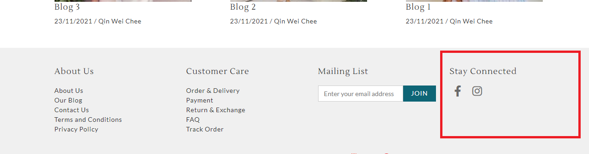

# Custom Widget

## Define A Custom Widget

To define a custom widget, the way as example below in `meta.json` file

```
{
...
"widgets": [
    {
        "id": "social_media",
        "name": "Social Media Icons",
        "title": "Follow Us",
        "file_name": "social-media-icons.liquid",
        "settings_schema": [            
            {
                "label": "Social Platform",
                "type": "repetable-group",
                "id": "social_media_platforms",
                "count": 5,
                "options": [
                    {
                        "type": "select",
                        "label": "Platform Type",
                        "id": "platform_type",
                        "options": [
                            {
                                "value": "",
                                "label": ""
                            },
                            {
                                "value": "facebook",
                                "label": "Facebook"
                            },
                            {
                                "value": "facebook_messenger",
                                "label": "Facebook Messenger"
                            },
                            {
                                "value": "instagram",
                                "label": "Instagram"
                            },
                            {
                                "value": "pinterest",
                                "label": "Pinterest"
                            },
                            {
                                "value": "telegram",
                                "label": "Telegram"
                            },
                            {
                                "value": "tiktok",
                                "label": "Tiktok"
                            },
                            {
                                "value": "tumblr",
                                "label": "Tumblr"
                            },
                            {
                                "value": "twitter",
                                "label": "Twitter"
                            },
                            {
                                "value": "vimeo",
                                "label": "Vimeo"
                            },
                            {
                                "value": "whatsapp",
                                "label": "Whatsapp"
                            },                                
                            {
                                "value": "youtube",
                                "label": "Youtube"
                            }
                        ]
                    },
                    {
                        "type": "text",
                        "label": "Platform URL",
                        "id": "platform_url"
                    }
                ]
            }
        ],
        "default_settings": {
            "social_media_platforms": [
                {
                    "platform_type": "facebook",
                    "platform_url": "https://www.facebook.com/"
                },
                {
                    "platform_type": "instagram",
                    "platform_url": "https://www.instagram.com/"
                }
            ]
        }
    }
],
...
}
```

## Custom Social Media Icons Widget

The custom widget created from `meta.json` can be configured in Appearance > Widget.

.png>)

## Liquid

Once the custom widget defined in meta.json, liquid file need to be created for rendering layout, for example `social-media-icons.liquid`.

## Layout

